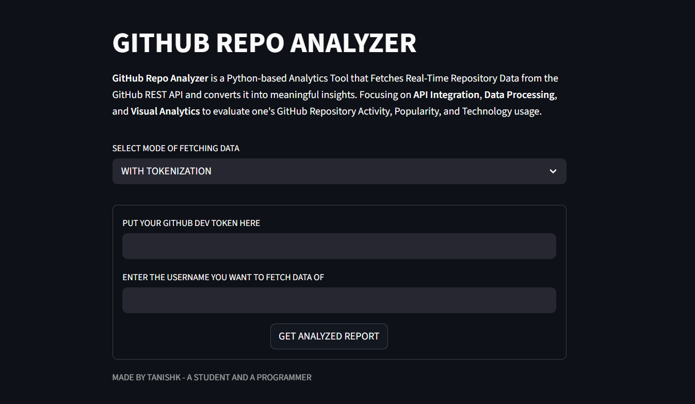
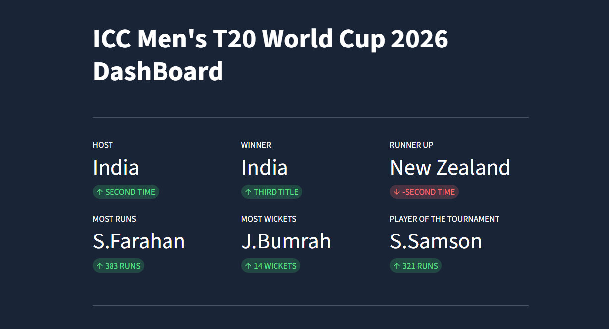

# ABOUT ME
Hey There! I'm a passionate 15-year-old programmer from Pithoragarh, Uttarakhand, with a deep interest in technology and innovation. My journey into programming began in 2025, and since then, I've been captivated by the endless possibilities that code offers. As a student I balance my academic pursuits with my love for programming and software development.
 
My primary focus is on Python programming, particularly in the domains of Artificial Intelligence and Machine Learning. I believe that technology has the power to solve real-world problems, and I'm committed to developing my skills to become a proficient software developer. Through continuous learning and hands-on projects, I'm building a strong foundation in programming while exploring the fascinating world of data science and AI.

# SOCIAL LINKS
 

# TECHNICAL STACK

## CURRENT SKILLS 
- Core Python Programming
- Pandas - Data Analysis
- NumPy - Numerical Computing
- Matplotlib - Data Visualization
- Streamlit - UI Integration
- API Integration and Web Scrapping
- SQlite Local Database
- MongoDB Atlas Cloud Database

## LEARNING PATH 
- Frontend Web Development
- Database Management Systems
- Cloud and Authentication
- Data Structures and Algorithms 
- System Design

# PROJECTS 
### Github Repo Analyzer - Python
- APP : https://githb-repo-analyzer-tanishkbhatt.streamlit.app
- SOURCE : https://github.com/TanishkBhatt/Github-Repo-Analyzer/

### Analytics Dashboard - Streamlit
- APP : https://cricket-analytics-dashboard-tanishkbhatt.streamlit.app/
- SOURCE : https://github.com/TanishkBhatt/Cricket-Analytics-Dashboard/

# GITHUB STATS

---